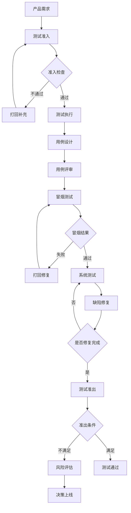

# 完整业务测试指南

## 目录
1. [业务测试概述](#业务测试概述)
2. [测试流程管理](#测试流程管理)
3. [质量监控指标体系](#质量监控指标体系)
4. [测试执行标准](#测试执行标准)
5. [质量评估与改进](#质量评估与改进)
6. [附录](#附录)

---

## 业务测试概述

### 1.1 业务测试定义
业务测试是指在软件开发生命周期中，对业务功能、性能、稳定性进行全面验证的测试活动。其目标是确保产品满足业务需求，具备良好的用户体验和系统稳定性。

### 1.2 测试原则
- **质量优先**：质量是产品生命线，测试必须严格把关
- **风险可控**：识别并控制质量风险，确保上线安全
- **效率平衡**：在保证质量的前提下，提高测试效率
- **持续改进**：基于数据驱动，持续优化测试流程

---

## 测试流程管理

### 2.1 测试流程架构图



### 2.2 测试阶段详细流程

| 阶段 | 主要活动 | 参与角色 | 输出物 | 准入/准出条件 |
|------|----------|----------|--------|---------------|
| **测试准入** | 需求文档评审<br>技术方案评审<br>测试建议收集 | 产品经理<br>研发负责人<br>测试负责人 | 需求文档<br>技术文档<br>测试建议 | 文档完整性<br>技术可行性<br>测试环境就绪 |
| **用例设计** | 功能用例设计<br>性能用例设计<br>容灾用例设计 | 测试工程师<br>产品经理 | 测试用例集<br>用例评审报告 | 用例覆盖率≥95%<br>用例评审通过 |
| **用例评审** | 用例逻辑评审<br>覆盖度检查<br>可行性评估 | 产品经理<br>研发负责人<br>测试负责人 | 评审记录<br>修改意见 | 评审通过率≥90% |
| **冒烟测试** | P0用例执行<br>基础功能验证 | 测试工程师 | 冒烟测试报告 | P0用例100%通过 |
| **系统测试** | 全量用例执行<br>缺陷跟踪<br>回归测试 | 测试工程师<br>研发工程师 | 测试执行报告<br>缺陷报告 | 缺陷修复率≥95%<br>轮次≤3轮 |
| **测试准出** | 准出条件检查<br>风险评估<br>上线决策 | 测试负责人<br>产品经理<br>技术负责人 | 准出报告<br>风险评估报告 | 功能完整性<br>性能达标<br>容灾验证 |

### 2.3 特殊场景测试要求

| 场景类型 | 测试要求 | 关键指标 | 验收标准 |
|----------|----------|----------|----------|
| **转发面改动** | 性能测试方案<br>基准测试<br>压力测试 | 吞吐量<br>延迟<br>丢包率<br>CPU使用率 | 性能指标≥基准值<br>稳定性测试≥24小时 |
| **架构改动**<br>（主主/主备） | 容灾测试方案<br>故障切换测试<br>数据一致性验证 | 切换时间<br>数据一致性<br>服务可用性 | 切换时间≤30秒<br>数据零丢失<br>服务可用性≥99.9% |
| **数据库改动** | 数据迁移测试<br>性能影响评估<br>回滚方案验证 | 迁移时间<br>数据准确性<br>性能影响 | 迁移时间可控<br>数据100%准确<br>性能影响≤10% |

### 2.4 测试轮次管理

| 轮次 | 执行内容 | 通过标准 | 失败处理 |
|------|----------|----------|----------|
| **第1轮** | 全量功能测试<br>性能测试<br>容灾测试 | 所有P0/P1缺陷修复<br>性能指标达标 | 修复后进入第2轮 |
| **第2轮** | 回归测试<br>新增缺陷验证<br>性能回归 | 所有缺陷修复验证<br>无新P0/P1缺陷 | 修复后进入第3轮 |
| **第3轮** | 重点功能验证<br>风险点确认 | 关键功能稳定<br>风险可控 | 评估是否上线 |

---

## 质量监控指标体系

### 3.1 核心指标总览

| 指标类别 | 指标名称 | 计算公式 | 目标值 | 监控频率 |
|----------|----------|----------|--------|----------|
| **流程效率** | 完成提测率 | 完成提测数/总提测数×100% | ≥85% | 周/月 |
| **质量投入** | 自测覆盖率 | 自测用例数/总用例数×100% | ≥60% | 周 |
| **准入质量** | 打回率 | 打回提测数/总提测数×100% | ≤15% | 周 |
| **产品质量** | 测试不通过率 | 测试不通过数/总提测数×100% | ≤10% | 周 |
| **缺陷管理** | 缺陷密度 | 缺陷总数/代码行数(千行) | ≤5个/KLOC | 月 |
| **测试效率** | 平均轮次 | 总测试轮次/完成提测数 | ≤2.5轮 | 月 |
| **风险控制** | 高轮次项目率 | ≥3轮项目数/总项目数×100% | ≤5% | 月 |

### 3.2 指标详细说明

| 指标名称 | 指标定义 | 设计思路 | 考核内容 | 质量价值 | 改进方向 |
|----------|----------|----------|----------|----------|----------|
| **完成提测** | 成功完成测试流程的提测任务数量 | 反映测试流程完成效率，体现团队协作质量 | • 提测任务完成率<br>• 测试流程执行规范性<br>• 团队协作效率 | 高完成率表明测试流程顺畅，团队协作良好 | • 优化测试流程<br>• 加强团队协作<br>• 提升工具效率 |
| **自测数量** | 研发团队正式提测前自测用例数量 | 体现研发团队质量意识和自测投入 | • 自测覆盖率<br>• 自测用例质量<br>• 自测发现问题数 | 高质量自测可减少正式测试轮次，提高整体效率 | • 提升自测质量<br>• 完善自测工具<br>• 加强质量培训 |
| **打回提测** | 因不满足准入条件被退回的提测任务数 | 反映提测质量，体现准入标准执行情况 | • 打回原因分析<br>• 准入标准执行情况<br>• 提测准备充分性 | 控制打回率可减少无效测试，提高测试效率 | • 完善准入标准<br>• 加强提测准备<br>• 优化评审流程 |
| **测试不通过** | 经过完整测试但未达准出标准的提测任务数 | 反映产品质量状况，体现质量把控效果 | • 不通过原因分析<br>• 质量风险识别<br>• 改进措施执行 | 低不通过率表明产品质量稳定，质量把控有效 | • 加强质量把控<br>• 优化开发流程<br>• 提升代码质量 |
| **缺陷数量** | 测试过程中发现的有效缺陷总数 | 量化产品质量问题，指导质量改进方向 | • 缺陷密度<br>• 缺陷严重程度分布<br>• 缺陷修复及时性<br>• 缺陷重复率 | 缺陷数量和质量分布反映代码质量和开发规范执行情况 | • 加强代码审查<br>• 建立缺陷预防机制<br>• 优化开发规范 |
| **平均轮次** | 完成测试所需的平均轮次数量 | 反映测试效率，体现问题修复质量 | • 轮次分布情况<br>• 轮次减少趋势<br>• 问题修复效率 | 低平均轮次表明问题修复质量高，测试效率好 | • 优化问题修复流程<br>• 提升修复质量<br>• 加强沟通协作 |
| **≥3轮提测** | 需要3轮或以上测试才能完成的提测任务数 | 识别质量风险较高的项目，重点关注 | • 高轮次项目占比<br>• 高轮次原因分析<br>• 改进措施效果 | 控制高轮次项目可提高整体测试效率，降低质量风险 | • 重点项目管理<br>• 风险预警机制<br>• 专项改进措施 |

### 3.3 指标监控维度

| 监控维度 | 分析内容 | 展示方式 | 更新频率 |
|----------|----------|----------|----------|
| **时间维度** | 日/周/月/季度趋势分析 | 趋势图表、同比环比分析 | 实时/日/周/月 |
| **业务维度** | 按业务线、产品模块分组分析 | 对比图表、排名分析 | 周/月 |
| **团队维度** | 按开发团队、测试团队分组分析 | 对比图表、排名分析 | 周/月 |
| **项目维度** | 按项目类型、优先级分组分析 | 分布图表、详情钻取 | 实时/日 |

### 3.4 预警机制

| 预警等级 | 触发条件 | 响应措施 | 负责人 |
|----------|----------|----------|--------|
| **红色预警** | 关键指标严重偏离目标值(>20%) | 立即分析根因，制定改进计划 | 质量负责人 |
| **黄色预警** | 指标接近警戒线(10-20%) | 关注趋势，准备应对措施 | 测试负责人 |
| **绿色正常** | 指标在正常范围内(<10%) | 持续监控，保持现状 | 测试工程师 |

---

## 测试执行标准

### 4.1 测试环境管理

#### 4.1.1 环境要求
- **一致性**：测试环境与生产环境配置一致
- **隔离性**：不同测试任务间环境隔离
- **稳定性**：环境稳定，减少环境问题干扰
- **可恢复性**：支持快速环境重置和恢复

#### 4.1.2 数据管理
- **测试数据**：准备充分的测试数据
- **数据隔离**：测试数据与生产数据隔离
- **数据清理**：测试完成后及时清理测试数据

### 4.2 测试工具与平台

#### 4.2.1 Metersphere平台使用
- **用例管理**：在Metersphere中创建和管理测试用例
- **执行记录**：记录测试执行过程和结果
- **缺陷管理**：在平台中跟踪缺陷状态
- **报告生成**：自动生成测试报告

#### 4.2.2 工具集成
- **持续集成**：与CI/CD流水线集成
- **自动化测试**：集成自动化测试工具
- **监控工具**：集成性能监控和日志分析工具

### 4.3 测试报告标准

#### 4.3.1 报告内容
- **执行概况**：测试范围、执行时间、参与人员
- **用例统计**：用例总数、通过数、失败数、跳过数
- **缺陷统计**：缺陷总数、严重程度分布、修复状态
- **性能数据**：响应时间、吞吐量、资源使用率
- **风险评估**：质量风险识别和评估

#### 4.3.2 报告格式
- **标准化模板**：使用统一的报告模板
- **数据可视化**：图表展示关键数据
- **结论明确**：明确的测试结论和建议

---

## 质量评估与改进

### 5.1 质量评估方法

| 评估维度 | 评估方法 | 评估频率 | 输出结果 |
|----------|----------|----------|----------|
| **定量评估** | 基于指标权重计算综合质量分数 | 月/季度 | 质量分数、趋势分析 |
| **定性评估** | 专家评审、用户反馈、风险评估 | 季度 | 质量评估报告 |
| **对比分析** | 与历史数据、行业标准对比 | 月/季度 | 对比分析报告 |

### 5.2 持续改进机制

| 改进环节 | 主要活动 | 参与角色 | 输出物 |
|----------|----------|----------|--------|
| **问题分析** | 根因分析、模式识别、改进机会识别 | 质量团队、技术团队 | 问题分析报告 |
| **改进措施** | 流程优化、工具改进、培训提升 | 质量团队、HR团队 | 改进计划 |
| **效果跟踪** | 改进效果跟踪、指标变化监控 | 质量团队 | 改进效果报告 |

### 5.3 质量文化建设

- **质量意识**：建立全员质量意识，明确各角色质量责任
- **知识分享**：定期总结测试经验，分享典型测试案例
- **激励机制**：建立质量激励机制，鼓励质量改进

---

## 附录

### A. 测试用例模板
```
用例编号：TC_001
用例名称：[功能名称]_[测试场景]
前置条件：[执行测试的前提条件]
测试步骤：
1. [具体操作步骤1]
2. [具体操作步骤2]
3. [具体操作步骤3]
预期结果：[期望的测试结果]
实际结果：[实际测试结果]
测试结果：通过/失败/跳过
备注：[其他说明]
```

### B. 测试报告模板
```
测试报告
项目名称：[项目名称]
测试版本：[版本号]
测试时间：[开始时间] - [结束时间]
测试人员：[测试人员名单]

1. 测试概况
   1.1 测试范围
   1.2 测试环境
   1.3 测试工具

2. 测试结果
   2.1 用例执行统计
   2.2 缺陷统计
   2.3 性能测试结果（如适用）

3. 风险评估
   3.1 质量风险
   3.2 上线建议

4. 附录
   4.1 测试用例清单
   4.2 缺陷清单
   4.3 性能测试数据
```

### C. 指标计算公式汇总
- 完成提测率 = 完成提测数 / 总提测数 × 100%
- 打回率 = 打回提测数 / 总提测数 × 100%
- 测试不通过率 = 测试不通过数 / 总提测数 × 100%
- 缺陷密度 = 缺陷总数 / 代码行数（千行）
- 平均修复时间 = 缺陷修复总时间 / 缺陷总数
- 一次通过率 = 一轮通过数 / 总提测数 × 100%

### D. 常见问题与解决方案
1. **提测质量差**
   - 解决方案：加强准入标准执行，提高自测质量
   
2. **测试轮次过多**
   - 解决方案：优化问题修复流程，提高修复质量
   
3. **缺陷重复率高**
   - 解决方案：加强代码审查，建立缺陷预防机制
   
4. **测试效率低**
   - 解决方案：推进自动化测试，优化测试流程

---

**文档版本：** v1.0  
**最后更新：** 2024年12月  
**维护团队：** 质量保障团队
