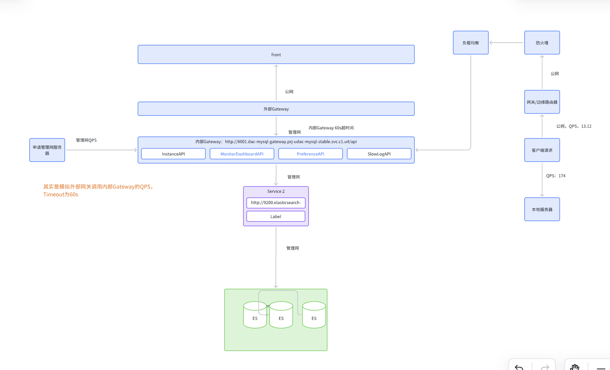

# UDAC压力测试项目案例

## 一、项目背景

UDAC数据库自治中心，核心场景为大规模用户并发下的慢日志查询。为保障平台上线后的稳定性和容量规划，需对其慢日志查询接口进行专项压力测试。

## 二、测试目标

- 明确系统在不同并发量下的最大QPS、TPS、响应时间和资源利用率
- 识别系统的性能瓶颈和极限容量
- 验证在高并发下的稳定性和异常处理能力
- 为后续容量规划和优化提供数据支撑

## 三、测试环境

- **网络架构**：外部Gateway通过管理网访问内部API，API服务调度三节点ES集群（参考下图）

  

- **测试机**：虚拟机，IP：10.179.64.154
- **ES集群**：3节点，每节点4C8G
- **数据量**：每个ES实例约90MB，44万条慢日志，极端情况考虑50GB（本次未覆盖）
- **监控工具**：Prometheus + Grafana，数据源为uae-c1，namespace为prj-udac-mysql-stable

## 四、测试方案

- **测试工具**：Apache Bench（ab）
- **测试接口**：慢日志查询API
- **测试数据**：request.json（模拟实际查询请求）
- **负载策略**：基于ab机制，快速达到指定并发后持续压测，覆盖100~5000并发
- **监控指标**：QPS、TPS、接口响应时间、ES节点CPU负载

## 五、测试过程与数据

### 1. 并发/1200条日志

| 并发数 | 持续时间 | QPS/TPS | 查询总数 | ES最大CPU负载 | 备注 |
|--------|----------|---------|----------|---------------|------|
| 100    | 5min     | 158.56  | 57,082,800 | 83.41% 78.05% 42.01% | ab -t 300 -c 100 ... |
| 100    | 10min    | 158.65  | 60,000,000 | 83% 74% 39% | ab -t 600 -c 100 ... |
| 300    | 5min     | 169.25  |           | 85% 71% 41% | ab -t 300 -c 300 ... |
| 500    | 5min     | 172     |           | 82% 80% 41% | ab -t 300 -c 500 ... |
| 700    | 5min     | 169.92  |           | 84% 80% 42% | ab -t 300 -c 700 ... |
| 5000   | 5min     | 10%超时 |           | 93% 90% 40% | ab -t 300 -c 5000 ... |

- 700并发前，QPS和响应时间均符合预期，无超时
- 超过700并发，出现<1%超时
- 5000并发时，CPU负载超90%，超时率达10%

### 2. 高负载分步递增测试

- 以500为起点，每步递增800并发，7步到5600并发，每步6分钟，最终高并发持续压测100分钟
- 结果：系统在5600并发下资源接近极限，部分请求超时，CPU利用率高企

### 3. 不同日志量下的并发测试

- 500/1000/3000/5000/10000条日志，均做并发递增测试，记录QPS、响应时间、CPU负载
- 发现日志量越大，系统瓶颈越早暴露，响应时间增长更快

## 六、测试结论

- UDAC慢日志查询接口在700并发以下表现稳定，QPS和响应时间均达标
- 700~5000并发区间，系统逐步进入瓶颈，超时率上升，CPU利用率接近饱和
- 极限并发下（5000+），超时率显著，需优化架构或扩容
- 当前业务场景下，系统性能满足预期，但需关注极端高并发场景

## 七、优化建议与思考

1. **ES集群扩容**：增加节点或提升单节点配置，提升整体处理能力
2. **查询优化**：慢日志查询可考虑分片、缓存、异步等手段
3. **接口限流**：对外暴露接口建议加限流，防止雪崩
4. **监控告警**：完善Prometheus+Grafana监控，设置合理阈值
5. **压测脚本多样化**：后续可引入JMeter/Locust等支持更复杂业务场景

---

# 面试官与面试者问答环节

---

**面试官1**：你为什么选择AB作为压力测试工具？它有哪些优缺点？

**面试者**：  
AB（Apache Bench）非常适合HTTP接口的基础性能压测，优点是轻量、易用、上手快，能快速模拟高并发场景，适合接口初步容量评估。  
缺点是功能单一，不支持复杂业务流程、参数化和分布式场景，结果分析也较为基础。对于更复杂的业务流程或需要分布式压测时，我会选择JMeter或Locust等工具。

---

**面试官2**：你是如何判断系统瓶颈出现的？具体用到了哪些数据和分析方法？

**面试者**：  
我主要通过QPS/TPS曲线、响应时间曲线和CPU利用率来判断。  
- 当并发增加时，QPS增速放缓甚至平台期，响应时间急剧上升，说明系统已达瓶颈。  
- 结合Prometheus监控的ES节点CPU利用率，发现CPU接近饱和时，超时率也同步上升。  
- 此外，我还关注每线程每秒请求数的变化，发现其下降时，说明系统已进入衰减期。

---

**面试官3**：你在测试过程中遇到过哪些异常？是如何定位和解决的？

**面试者**：  
主要异常是高并发下部分请求超时。  
定位方法：  
- 先排查接口本身的响应日志，确认是后端处理慢而非网络抖动  
- 结合ES节点的CPU、内存、IO监控，发现CPU利用率高企时超时率同步上升  
- 通过分步递增并发，定位到700并发是临界点  
解决思路：  
- 优化ES查询语句，减少全表扫描  
- 增加ES节点或提升配置  
- 对接口加限流，避免雪崩

---

**面试官4**：如果让你进一步优化UDAC的慢日志查询性能，你会怎么做？

**面试者**：  
- 首先评估ES集群的扩容性，增加节点或提升单节点配置  
- 优化慢日志索引结构，减少查询耗时  
- 引入缓存机制，对热点查询结果做缓存  
- 对外接口加限流和降级策略，防止极端情况下影响整体服务  
- 持续完善监控和告警，做到问题早发现早处理

---

**面试官5**：你如何保证测试数据的真实性和测试结果的可复现性？

**面试者**：  
- 测试数据来源于生产快照，保证数据分布和量级与实际场景一致  
- 测试环境与生产环境网络、硬件配置尽量一致  
- 所有测试脚本、参数、环境配置均有版本管理，测试过程可复现  
- 多次重复测试，取平均值，排除偶发异常

---

**面试官6**：你怎么看待“容量性能场景”与“稳定性性能场景”的区别？

**面试者**：  
容量性能场景关注系统的极限承载能力，目标是找到系统的最大QPS、并发数等极限指标；  
稳定性性能场景则关注系统在长时间持续压力下的表现，比如内存泄漏、资源回收、服务可用性等。  
两者结合，既能发现系统极限，也能保障长期稳定运行。

---

**面试官7**：你在本次项目中有哪些收获和反思？

**面试者**：  
- 压测不仅仅是跑数据，更重要的是结合监控、日志、架构理解做全链路分析  
- 工具选择要结合实际场景，不能盲目追求“高大上”  
- 性能瓶颈往往是多因素叠加，需多维度监控和分析  
- 规范化的测试流程和数据管理对结果的可复现性和说服力至关重要

---

如需补充更细致的数据表格、脚本示例或更深入的面试问答，可随时告知！

